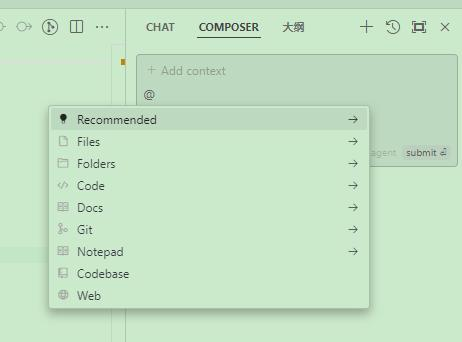

CURSOR工具使用方法与技巧
======================================

快捷键及其功能
----------------

- **打开对话框CHAT**：`CTRL + L`
   -  打开 AI 聊天面板，支持上下文查询，获取建议或解决问题。

- **打开生成窗口**：`CTRL + K`
   -  用于在编辑器中快速生成代码片段或修改选定代码，通常针对当前文件。

- **打开 Composer**：`CTRL + I`
   -  在代码中进行智能插入，帮助快速定位和插入代码块，甚至可以组织多文件的关联处理。

- **Tab 功能**：`Tab`
   -  多行补全
   -  智能重写（Smart Rewrite）
   -  光标预测（Cursor Prediction）

便捷提供上下文信息的注记
------------------------

为了更方便地向大语言模型提供上下文信息，Cursor 内置了不同类型的 @ 注记。使用这些 @ 注记，可以轻松地将各种上下文信息注入到你的对话中。
有些 @ 注记是通用的，可以在所有对话窗口中使用；而有些则是特定功能

- **@ Files**：传递指定代码文件的上下文。
   当你在对话框中输入 @Files 注记时，Cursor 会自动弹出你代码仓库的检索列表。你可以输入想要导入上下文的文件名，按下确认键后，相应文件的内容将自动注入到上下文中。

- **@ Code**：提供更精确的代码片段。
   代码块的识别由你开发环境的 LSP（语言服务器协议）决定，通常情况下识别的准确性较高。

- **@ Docs**：从函数或库的官方文档中获取上下文。
   该注记可以从可访问的在线文档中提取信息，确保上下文信息的准确性。

- **@ Web**：从搜索引擎获取上下文。
   该注记会默认先将你的提问发送到搜索引擎，然后从搜索结果中提取上下文供 LLM 使用。

- **@ Folders**：传递文件目录信息的上下文。
   该注记可以提供与文件目录相关的信息，帮助解决路径相关的问题。

- **@ Chat**：仅在文件内的代码生成窗口使用。
   该注记能够将你在右侧打开的对话窗口中的对话内容作为上下文传递给大模型。

- **@ Definitions**：仅在文件内的代码生成窗口使用。
   该注记会将光标所在行代码涉及的变量和类型的相关定义作为上下文传递给大模型。

- **@ Git**：仅在对话窗口使用。
   该注记能够将你当前 Git 仓库的 commit 历史作为上下文传递给大模型。

- **@ Codebase**：仅在对话窗口使用，用于扫描代码仓中的文件。
   该注记可以从代码仓中找到你所需文件的上下文。

- **@Notepads**：Cursor 中强大的上下文共享工具。
   它弥合了编辑器与聊天交互之间的差距。可以将其视为超越 .cursorrules 功能的增强型参考文档，帮助您为开发工作流程创建可重复使用的上下文。

举例
----

利用Cursor的Tab功能进行代码光标预测
,,,,,,,,,,,,,,,,,,,,,,,,,,,,,,,,,,,,,

  .. image:: images/CURSOR-7.jpg
    :width: 800px
    :align: center
    :alt: Inserting a Sphinx directive

利用Cursor的@ Codebase分析嵌入式软件项目
,,,,,,,,,,,,,,,,,,,,,,,,,,,,,,,,,,,,,,,,,,,,,,,,,,,,

**1.构建代码索引**：首先,我们使用Cursor的代码索引功能,快速了解项目的结构。

  .. image:: images/CURSOR-2.jpg
    :width: 800px
    :align: center
    :alt: Inserting a Sphinx directive

**2.项目总体分析**：接下来,我们利用Cursor的AI对话功能,对整个项目进行分析。

  .. image:: images/CURSOR-3.jpg
    :width: 800px
    :align: center
    :alt: Inserting a Sphinx directive

**3.代码片段生成**：最后,我们使用Cursor的代码片段生成功能,快速生成代码片段。

  .. image:: images/CURSOR-4.jpg
    :width: 800px
    :align: center
    :alt: Inserting a Sphinx directive

利用Cursor的@ Git进行代码分支修复的检查
,,,,,,,,,,,,,,,,,,,,,,,,,,,,,,,,,,,,,,,,,,,,

**1.查看代码变更**：首先,我们使用Cursor的Git注记,查看代码变更。

-  PR（Diff of Main Branch）：当前分支与主分支的 diff
-  待提交的修改（Commit:Diff with Working State）：在你的 git 工作区中还没 add 的代码信息。
-  已提交的Commit：代码库中管理的所有 Commits

  .. image:: images/CURSOR-5.jpg
    :width: 800px
    :align: center
    :alt: Inserting a Sphinx directive

**2.代码分支检查**：接下来,我们使用Cursor的AI对话功能,检查代码分支。

  .. image:: images/CURSOR-6.jpg
    :width: 800px
    :align: center
    :alt: Inserting a Sphinx directive

**3.代码修复建议**：最后,我们使用Cursor的代码片段生成功能,获取代码修复建议。

利用Cursor的@ Docs进行函数实现与手册的匹配检验
,,,,,,,,,,,,,,,,,,,,,,,,,,,,,,,,,,,,,,,,,,,,,,,

  .. image:: images/CURSOR-8.png
    :width: 800px
    :align: center
    :alt: Inserting a Sphinx directive

.. tip:: 免费使用Cursor Pro.

    对于想要继续使用免费试用的用户，Cursor提供了一个非官方的方法来延长试用期限。

    等待当前的试用权限到期，访问你的Cursor设置页面: https://www.cursor.com/settings

    滚动到页面底部，找到"Delete"（删除账户）选项 Cursor删除账户界面

    选择删除你的账户

    使用相同的邮箱地址重新注册一个新账户

    实测这个方法也可以供参考。https://blog.csdn.net/caoxiaoye/article/details/144397875
